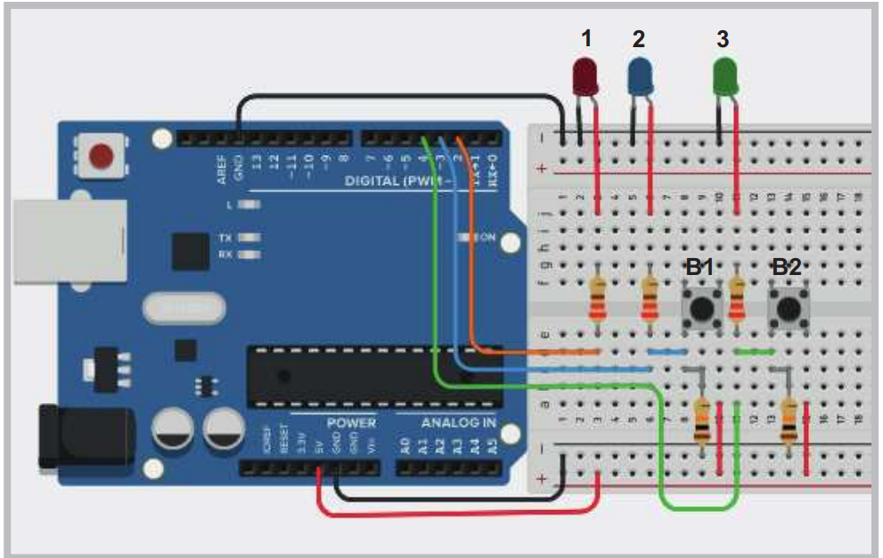

2'li Buton Klanımı
İki buton ile dijital giriş uygulamasının programı
Gerekli Devre Elemanları

• 1 adet mikrodenetleyici kart

• 1 adet breadboard

• 1 adet buton

• 3 adet LED

• 3 adet 220Ω (kırmızı, kırmızı, kahverengi, altın rengi) direnç

• 1 adet 10KΩ (kahverengi, siyah, kırmızı, altın rengi) direnç

• Bağlantı kabloları

